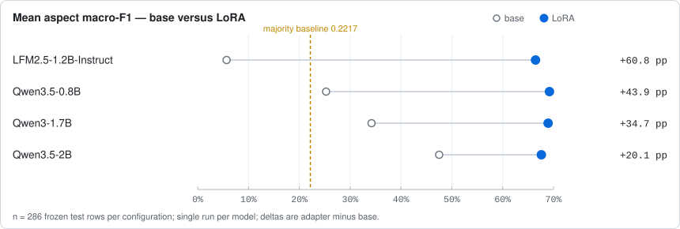
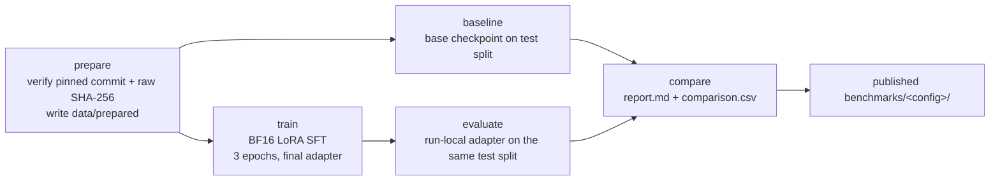

# HOASA ABSA — SLM Fine-Tuning Benchmark

Case study: fine-tune four small language models (SLMs) on one narrow aspect-based sentiment analysis task — Indonesian hotel reviews from the IndoNLU **HoASA** dataset (`hoasa_absa-airy`, Airy) — and compare every LoRA adapter against its own base checkpoint under one shared Indonesian prompt, one shared parser and one shared metric implementation. The same majority baseline anchors the floor in all four runs.

**Research questions**

1. Does LoRA fine-tuning improve mean aspect macro-F1 over the base checkpoint, per model? (base vs fine-tuned, same frozen 286-row test split, same evaluator)
2. How do the measured gains relate to nominal parameter count and to the shared majority baseline (0.221669)?


> [!WARNING]
> **Single-track, single-run, no leaderboard equivalence.** All four configurations are full BF16 LoRA runs (no quantization) evaluated once each on one frozen 286-row holdout; there are no confidence intervals or significance tests. Base vs fine-tuned within one configuration is matched (same split bytes, same evaluator); cross-model differences are descriptive only. This project defines its own parser and aggregation and claims no equivalence with any official IndoNLU leaderboard.

**Scope.** Ten-aspect, four-label sentence-level ABSA (`neg`, `neut`, `pos`, `neg_pos`) on Airy hotel reviews: exactly one plain JSON object per review, with `INVALID` kept in the metric denominator. One prompt, parser and metric implementation serve the base-model baseline, the LoRA fine-tune and the majority baseline. Not a general ABSA framework (no token-level spans, no multi-task routing), and all runs are text-only with full BF16 base weights — no quantization and no fallback mode.

## At a glance

| Snapshot | Value |
|---|---|
| Configurations | 4 completed (all full BF16, LoRA `r=16`/`alpha=32`, final-epoch-3 adapter) |
| Evaluations per configuration | Base checkpoint + LoRA adapter + shared majority baseline, same frozen split |
| Mean aspect macro-F1 improved | 4 of 4 configurations |
| Largest delta | +0.607801 — LFM2.5-1.2B-Instruct (0.056927 → 0.664728) |
| Smallest delta | +0.201222 — Qwen3.5-2B (0.475039 → 0.676261) |
| Best fine-tuned score | 0.692106 — Qwen3.5-0.8B (base 0.252686) |
| Majority baseline floor | 0.221669 (identical in all four runs) |
| Frozen test split | 286 labeled rows, official HoASA test split from pinned commit `ce728f69…`; same prepared-test SHA-256 in every run |
| Hardware | 1× NVIDIA GeForce RTX 5060 Ti, CUDA 12.8 |
| Peak allocated VRAM, fine-tuned evaluation | 1.701–4.259 GiB |

Values are read from the committed `*_metrics.json` files under [`benchmarks/`](benchmarks/); exact links are in [Evidence](#evidence).

## Base → LoRA mean aspect macro-F1



Open markers are base checkpoints, filled markers are LoRA adapters, and the dashed line is the shared majority baseline (0.221669). Chart values are rounded from the [results table](#results-exact-values).

## Key findings

- **All four configurations improved.** Mean aspect macro-F1 rose in every run: +0.607801 (LFM2.5-1.2B-Instruct), +0.439421 (Qwen3.5-0.8B), +0.347358 (Qwen3-1.7B), +0.201222 (Qwen3.5-2B). These are single-run differences on the frozen 286-row split; no significance claim is made.
- **Output validity differs sharply at base.** LFM2.5-1.2B-Instruct's base produced schema-valid JSON on 5.2% of rows (`schema_valid_rate` 0.052448) and scored near the floor (0.056927); after fine-tuning it reached 0.664728 with a 1.0 schema-valid rate. Qwen3.5-2B is the only fine-tuned adapter below 1.0 schema-valid (0.965035).
- **Not monotonic in nominal size.** The largest gain comes from a 1.2B model and the best fine-tuned score from the 0.8B model (0.692106); the 2B model gained least (+0.201222) despite starting from the strongest base score (0.475039). No "bigger is better" claim is made.
- **All fine-tuned results clear the majority floor.** Majority baseline 0.221669; fine-tuned scores span 0.664728–0.692106. At base, three of four checkpoints clear the floor (0.475039, 0.342083, 0.252686) while LFM2.5-1.2B-Instruct (0.056927) does not.
- **Whole-review exact accuracy improves too.** Base 0.000000–0.125874 → fine-tuned 0.730769–0.793706 across the four configurations.
- **Resources are descriptive, single-machine numbers.** All runs used one RTX 5060 Ti; fine-tuned mean latency was 692.0–6408.7 ms/review (peak allocated VRAM 1.701–4.259 GiB). Mean latency is `model.generate` time per review, so it includes prefill and is not pure decode throughput; no efficiency ranking is claimed.

## Results (exact values)

All four runs were evaluated on the same frozen 286-row labeled HoASA test split (`dataset_stats.json` records the same prepared-test SHA-256, `10ea1e8c…`, in every directory) on an `NVIDIA GeForce RTX 5060 Ti` (CUDA 12.8), full BF16 with no quantization, LoRA `r=16`/`alpha=32`, 3 epochs, final-epoch-3 adapter. Exact model and requested revisions are recorded in each directory's `resolved_config.yaml` and `run_manifest.json`. Mean latency is `model.generate` time per review and includes prefill. The labeled test split is a property of the pinned commit; the [Dataset](#dataset-pinned-unmodified) note applies, and no leaderboard equivalence is claimed.

Mean aspect macro-F1 is the primary metric; `INVALID` outputs stay in the denominator (definitions in [Methodology and dataset](#methodology-and-dataset)). Δ macro-F1 is fine-tuned minus base.

| Model | Mean aspect macro-F1 | Overall aspect accuracy | Whole-review exact accuracy | Schema-valid rate | Peak allocated VRAM (GiB) | Mean latency (ms/review) | Δ macro-F1 vs base |
|---|---|---|---|---|---|---|---|
| [Majority baseline](benchmarks/01-qwen3-1.7b/majority_metrics.json) | 0.221669 | 0.803497 | 0.000000 | 1.000000 | — | — | — |
| [Qwen3-1.7B base](benchmarks/01-qwen3-1.7b/baseline_metrics.json) | 0.342083 | 0.578671 | 0.017483 | 1.000000 | 3.307 | 972.273 | 0.000000 |
| [Qwen3-1.7B + LoRA](benchmarks/01-qwen3-1.7b/finetuned_metrics.json) | 0.689441 | 0.973427 | 0.779720 | 1.000000 | 3.397 | 1739.857 | +0.347358 |
| [Qwen3.5-0.8B base](benchmarks/02-qwen3.5-0.8b/baseline_metrics.json) | 0.252686 | 0.315385 | 0.000000 | 0.986014 | 1.660 | 1158.471 | 0.000000 |
| [Qwen3.5-0.8B + LoRA](benchmarks/02-qwen3.5-0.8b/finetuned_metrics.json) | 0.692106 | 0.975524 | 0.793706 | 1.000000 | 1.701 | 6036.983 | +0.439421 |
| [LFM2.5-1.2B-Instruct base](benchmarks/03-lfm2.5-1.2b-instruct/baseline_metrics.json) | 0.056927 | 0.031469 | 0.000000 | 0.052448 | 2.239 | 1003.184 | 0.000000 |
| [LFM2.5-1.2B-Instruct + LoRA](benchmarks/03-lfm2.5-1.2b-instruct/finetuned_metrics.json) | 0.664728 | 0.964336 | 0.730769 | 1.000000 | 2.311 | 692.037 | +0.607801 |
| [Qwen3.5-2B base](benchmarks/04-qwen3.5-2b/baseline_metrics.json) | 0.475039 | 0.789860 | 0.125874 | 0.986014 | 4.197 | 1435.629 | 0.000000 |
| [Qwen3.5-2B + LoRA](benchmarks/04-qwen3.5-2b/finetuned_metrics.json) | 0.676261 | 0.937413 | 0.734266 | 0.965035 | 4.259 | 6408.723 | +0.201222 |

## Pipeline



The `hoasa` CLI runs each phase in a fresh process (`prepare`, `preflight`, `majority-baseline`, `baseline`, `train`, `evaluate`, `compare`). `hoasa prepare` downloads and verifies the pinned raw CSVs before anything else runs; `hoasa preflight CONFIG` is metadata-only (no weights). The majority baseline is serialized as canonical JSON and scored through the same parser/metrics path. There is no automatic four-model runner — each configuration is run explicitly. Commands: [Reproduction](#reproduction).

## Methodology and dataset

### Dataset (pinned, unmodified)

- Repository: `IndoNLP/indonlu`, commit
  `ce728f6926a36174b9923dfe49d6a6839b6e9bb7`.
- Direct raw CSVs (one per official split):

  | Split | File | Rows | SHA-256 |
  |---|---|---|---|
  | train | `dataset/hoasa_absa-airy/train_preprocess.csv` | 2283 | `752935b62235f1a719c5e526e4ac68b3ba452f84a2a6f911ef20cb855b23546d` |
  | val | `dataset/hoasa_absa-airy/valid_preprocess.csv` | 285 | `7109001762f0bd83526d3de224c0ba5302bfb781eee6c1334aac8039a188f4fa` |
  | test | `dataset/hoasa_absa-airy/test_preprocess.csv` | 286 | `ce2c7c3f30359e08d4637eb65a05b5a685b888165d40b3133c48c99e1102b094` |

- CSV header: `review,ac,air_panas,bau,general,kebersihan,linen,service,sunrise_meal,tv,wifi`.
- `hoasa prepare` verifies the pinned commit URL, SHA-256, header, row counts,
  every label value and missing/empty values before accepting bytes. Official
  splits are preserved exactly: no cleaning, deduplication, re-splitting,
  balancing or augmentation. Exact duplicate reviews and empty cells are
  reported in `dataset_stats.json` (report only).
- **Caveat:** the root IndoNLU README states the HoASA test split is usually
  distributed masked. In this pinned commit an unmasked, labeled
  `test_preprocess.csv` exists and is used for evaluation; this is a property of
  this specific commit and is recorded in `dataset_stats.json`.
- The pinned test CSV is labeled. Do not use any masked file if one is present.

### Task, prompt, parsing and metrics

- One Indonesian system prompt (`hoasa_benchmark.spec.SYSTEM_PROMPT`) defines
  ABSA, all ten aspects and the four labels (`neg_pos` = mixed positive and
  negative sentiment on the same aspect). It asks for exactly one plain JSON
  object with all ten keys, no code fences and no explanation. The user message
  contains only the review text — never gold labels.
- Parser: full `json.loads` with duplicate-key detection. Whitespace and key
  order are accepted; fences/prose are rejected. Malformed JSON, a non-object,
  or duplicate keys anywhere make all aspects `INVALID`. For a parseable object,
  a missing key or an out-of-set value makes only that aspect `INVALID`. Extra
  keys make `schema_valid` false while canonical valid values still score.
  A duplicate-key output can be `syntax_valid` (valid JSON syntax) but is not an
  `output_valid`/`schema_valid` result.
- Fixed classes per aspect: `[neg, neut, pos, neg_pos]`. `INVALID` is never a
  fifth macro class but always remains in the denominator and counts as a false
  negative for the gold class.
- Formulas:
  - per class: `F1 = 2*TP / (2*TP + FP + FN)`, `precision = TP/(TP+FP)`,
    `recall = TP/(TP+FN)`, all with `zero_division=0`;
  - `macro_f1(aspect) = mean(F1(neg), F1(neut), F1(pos), F1(neg_pos))`;
  - `mean_aspect_macro_f1 = mean(macro_f1(aspect) for the 10 aspects)`;
  - `overall_aspect_accuracy = correct aspect predictions / (rows * 10)`
    (INVALID counts as wrong);
  - `whole_review_exact_accuracy` requires `schema_valid` **and** all ten
    aspects correct;
  - `syntax_valid_rate`, `schema_valid_rate`, `output_valid_rate` are fractions
    of rows over the test set.
- There is no claim of equivalence with any official leaderboard: this project
  defines its own parser and aggregation.
- Majority baseline: per-aspect train majority, serialized as canonical JSON and
  then parsed/evaluated through the same code path.
- Predictions JSONL rows: `id`, `gold`, `parsed`, `raw_output`, `validity`,
  `input_tokens`, `output_tokens`, `latency_ms`.
- Model metrics additionally include peak allocated/reserved VRAM (GiB, counters
  reset after model load), mean/median `model.generate` latency, reviews/second
  and output tokens/second — the latter divides generated tokens by total
  `model.generate` time, so it **includes prefill** and is not pure decode
  throughput.

### Precision, truncation, training policy

- Precision: **full BF16 base weights, no quantization** at any phase
  (`load_in_4bit=false`, `fp16=false`). Runtime checks fail closed on a
  quantization config, bitsandbytes modules, non-BF16 base parameters, or
  CPU/disk/meta placement; there is no fallback model or quantization mode.
- One shared training/inference helper truncates the review alone to
  `max_user_tokens=1536`, renders the model's native chat template and reserves
  `max_new_tokens=256` inside `max_seq_length=2048`, shrinking the user text
  further when needed. Fine-tuning uses the identical truncated user, appends
  the assistant target plus EOS and asserts the full system/user/assistant/EOS
  sequence fits; the target is never right-truncated.
- Training recipe: LoRA `r=16`, `alpha=32`, `dropout=0`, `bias=none`, gradient
  checkpointing (`unsloth`), 3 epochs, `lr=2e-4`, cosine schedule,
  `warmup_ratio=0.05`, `weight_decay=0.01`, `seed=42`, micro-batch 2 with
  gradient accumulation 4 (effective 8), eval batch 1, `adamw_8bit`,
  validation loss and checkpoints every epoch.
- Loss: explicit full-sequence language-model loss
  (`assistant_only_loss=false`, `completion_only_loss=false`,
  `prediction_loss_only=true`); both flags are stored in `train_metrics.json`.
- Checkpoint policy: **final epoch (epoch 3) adapter**, no best-checkpoint
  selection, no resume path.
- Vision models (`Qwen/Qwen3.5-0.8B`, `Qwen/Qwen3.5-2B`) are loaded with
  `FastVisionModel` but only language/attention/MLP LoRA is trained; the
  literal `all-linear` target is passed as `None` to `get_peft_model` so Unsloth
  honors `finetune_vision_layers=false`, and training fails closed if any
  vision-like parameter is trainable.
- Metadata preflight loads only `AutoConfig` + `AutoTokenizer`/`AutoProcessor`
  at the pinned revision inside the project-local `.cache/huggingface` cache and
  rejects weight files (`*.safetensors`, `*.bin`, `*.gguf`, `*.pt`, …). It never
  imports `AutoModel*` and never downloads weights.

### Environment

Validated with conda env `github-triage` (Python 3.11.16):
`torch 2.11.0+cu128`, `transformers 5.5.0`, `peft 0.20.0`, `datasets 4.3.0`,
`trl 0.24.0`, `unsloth 2026.9.4`, `unsloth_zoo 2026.9.3`,
`accelerate 1.15.0`, `bitsandbytes 0.50.2`, `PyYAML 6.0.3`, `tqdm 4.70.1`.
`scikit-learn` is intentionally not used; all metrics are implemented here.

```bash
pip install -e . --no-deps          # editable install, only PyYAML is required
```

Heavy imports (torch/transformers/peft/unsloth/trl/datasets/tqdm) are lazy:
`prepare`, `majority-baseline` and every `--help` work without them.

## Reproduction

```bash
pip install -e . --no-deps                  # editable install, only PyYAML is required
python -m unittest discover -s tests -v     # 94 tests, no GPU, no network
hoasa prepare                               # download/verify + write data/prepared
hoasa preflight CONFIG                      # metadata-only tokenizer/length report
hoasa majority-baseline --run-dir runs/majority  # train-majority floor
hoasa baseline CONFIG --run-dir DIR         # base model, shared evaluator
hoasa train CONFIG --run-dir DIR            # Unsloth BF16 LoRA SFT
hoasa evaluate CONFIG --checkpoint DIR/adapter --run-dir DIR
hoasa compare --run-dir DIR                 # report.md + comparison.csv
```

> [!IMPORTANT]
> **A fresh clone reproduces the pipeline, not the published artifacts.** `data/`, `runs/`, adapters, checkpoints and weights are git-ignored. `hoasa prepare` re-downloads and verifies the pinned raw CSVs; the ML phases need the pinned environment above and a CUDA GPU.

`hoasa baseline` evaluates the pinned base model only. `hoasa evaluate` requires
the run-local adapter produced by `hoasa train` (`<run-dir>/<training.adapter_subdir>`,
default `DIR/adapter`); `base`, model ids and adapter directories outside the run
directory are refused, so `finetuned_metrics.json` can only describe this run's
adapter. Before loading the adapter the evaluator cross-checks run-local
`train_metrics.json` and `run_manifest.json` on config hash, system prompt hash,
dataset hashes, base model and requested/pinned revision, and records a
provenance block in the metrics.

Four configs in `configs/` (exact revisions):

1. `01-qwen3-1.7b.yaml` — `Qwen/Qwen3-1.7B` @
   `70d244cc86ccca08cf5af4e1e306ecf908b1ad5e`, language, targets
   `q_proj,k_proj,v_proj,o_proj,gate_proj,up_proj,down_proj`,
   `enable_thinking=false`.
2. `02-qwen3.5-0.8b.yaml` — `Qwen/Qwen3.5-0.8B` @
   `2fc06364715b967f1860aea9cf38778875588b17`, vision (frozen tower),
   `all-linear`, `enable_thinking=false`.
3. `03-lfm2.5-1.2b-instruct.yaml` — `LiquidAI/LFM2.5-1.2B-Instruct` @
   `0f604ada3f766f9f257460c4c9f0b5d6f69d431b`, language, targets
   `q_proj,k_proj,v_proj,out_proj,in_proj,w1,w2,w3`, no chat-template kwargs.
4. `04-qwen3.5-2b.yaml` — `Qwen/Qwen3.5-2B` @
   `15852e8c16360a2fea060d615a32b45270f8a8fc`, vision (frozen tower),
   `all-linear`, `enable_thinking=false`. No resume field.

## Evidence

Published artifact directories (each directory also contains its own
`majority_metrics.json`):

- `01-qwen3-1.7b`: [dir](benchmarks/01-qwen3-1.7b/) ·
  [report](benchmarks/01-qwen3-1.7b/report.md) ·
  [comparison](benchmarks/01-qwen3-1.7b/comparison.csv) ·
  [base predictions](benchmarks/01-qwen3-1.7b/baseline_predictions.jsonl) ·
  [fine-tuned predictions](benchmarks/01-qwen3-1.7b/finetuned_predictions.jsonl) ·
  [train metrics](benchmarks/01-qwen3-1.7b/train_metrics.json) ·
  [config](benchmarks/01-qwen3-1.7b/resolved_config.yaml) ·
  [manifest](benchmarks/01-qwen3-1.7b/run_manifest.json) ·
  [environment](benchmarks/01-qwen3-1.7b/environment.json) ·
  [dataset stats](benchmarks/01-qwen3-1.7b/dataset_stats.json) ·
  [majority](benchmarks/01-qwen3-1.7b/majority_metrics.json)
- `02-qwen3.5-0.8b`: [dir](benchmarks/02-qwen3.5-0.8b/) ·
  [report](benchmarks/02-qwen3.5-0.8b/report.md) ·
  [comparison](benchmarks/02-qwen3.5-0.8b/comparison.csv) ·
  [base predictions](benchmarks/02-qwen3.5-0.8b/baseline_predictions.jsonl) ·
  [fine-tuned predictions](benchmarks/02-qwen3.5-0.8b/finetuned_predictions.jsonl) ·
  [train metrics](benchmarks/02-qwen3.5-0.8b/train_metrics.json) ·
  [config](benchmarks/02-qwen3.5-0.8b/resolved_config.yaml) ·
  [manifest](benchmarks/02-qwen3.5-0.8b/run_manifest.json) ·
  [environment](benchmarks/02-qwen3.5-0.8b/environment.json) ·
  [dataset stats](benchmarks/02-qwen3.5-0.8b/dataset_stats.json) ·
  [majority](benchmarks/02-qwen3.5-0.8b/majority_metrics.json)
- `03-lfm2.5-1.2b-instruct`: [dir](benchmarks/03-lfm2.5-1.2b-instruct/) ·
  [report](benchmarks/03-lfm2.5-1.2b-instruct/report.md) ·
  [comparison](benchmarks/03-lfm2.5-1.2b-instruct/comparison.csv) ·
  [base predictions](benchmarks/03-lfm2.5-1.2b-instruct/baseline_predictions.jsonl) ·
  [fine-tuned predictions](benchmarks/03-lfm2.5-1.2b-instruct/finetuned_predictions.jsonl) ·
  [train metrics](benchmarks/03-lfm2.5-1.2b-instruct/train_metrics.json) ·
  [config](benchmarks/03-lfm2.5-1.2b-instruct/resolved_config.yaml) ·
  [manifest](benchmarks/03-lfm2.5-1.2b-instruct/run_manifest.json) ·
  [environment](benchmarks/03-lfm2.5-1.2b-instruct/environment.json) ·
  [dataset stats](benchmarks/03-lfm2.5-1.2b-instruct/dataset_stats.json) ·
  [majority](benchmarks/03-lfm2.5-1.2b-instruct/majority_metrics.json)
- `04-qwen3.5-2b`: [dir](benchmarks/04-qwen3.5-2b/) ·
  [report](benchmarks/04-qwen3.5-2b/report.md) ·
  [comparison](benchmarks/04-qwen3.5-2b/comparison.csv) ·
  [base predictions](benchmarks/04-qwen3.5-2b/baseline_predictions.jsonl) ·
  [fine-tuned predictions](benchmarks/04-qwen3.5-2b/finetuned_predictions.jsonl) ·
  [train metrics](benchmarks/04-qwen3.5-2b/train_metrics.json) ·
  [config](benchmarks/04-qwen3.5-2b/resolved_config.yaml) ·
  [manifest](benchmarks/04-qwen3.5-2b/run_manifest.json) ·
  [environment](benchmarks/04-qwen3.5-2b/environment.json) ·
  [dataset stats](benchmarks/04-qwen3.5-2b/dataset_stats.json) ·
  [majority](benchmarks/04-qwen3.5-2b/majority_metrics.json)

Chart: [`assets/macro-f1-dumbbell.svg`](assets/macro-f1-dumbbell.svg) — hand-authored static SVG (no build step); values match the rounded `*_metrics.json` values in the [results table](#results-exact-values).

## Artifact policy (git)

Committed: `src/hoasa_benchmark/`, `configs/`, `tests/`, `pyproject.toml`, this README, the chart SVG, and the lightweight artifact set under `benchmarks/` (`report.md`, `comparison.csv`, `*_metrics.json`, `*_predictions.jsonl`, `resolved_config.yaml`, `run_manifest.json`, `environment.json`, `dataset_stats.json`).

Not committed: `data/` (raw and prepared files), `runs/`, `.cache/`, adapters, trainer checkpoints, and model weights.

## Run layout and artifacts

```
data/raw/                 pinned CSV bytes
data/prepared/            train.jsonl, val.jsonl, test.jsonl, dataset_stats.json
data/preflight/<name>.json
runs/<run>/               explicit --run-dir
  train.jsonl val.jsonl test.jsonl dataset_stats.json   # snapshot (first phase)
  resolved_config.yaml environment.json run_manifest.json
  baseline_metrics.json baseline_predictions.jsonl
  adapter/ trainer/ train_metrics.json
  finetuned_metrics.json finetuned_predictions.jsonl
  report.md comparison.csv
```

The first model phase snapshots the prepared splits and writes the run
metadata; every later phase re-verifies config projection, system prompt, model
identity/revision and dataset hashes and refuses to continue on any mismatch.
Every phase records `environment.json` (package versions plus
`torch.version.cuda`, CUDA availability and device names) and the evaluation
metrics carry the same CUDA/library identity. `hoasa compare` requires baseline
`mode=base` and fine-tuned `mode=adapter` with a matching provenance block, and
fails closed if the two runs differ in CUDA/GPU identity or the parity ML
library versions (torch, transformers, peft, bitsandbytes, accelerate) — a
comparison across machines is refused rather than reported.

## Reference

- Reference implementation (read-only): `/home/tilakoid/slm-specialist` at
  commit `d4f1f6bfcf39495af602649f0d532edd61a8b2ba`. Model-loading order,
  Unsloth peft kwargs, the loss-only SFT trainer subclass, EOS resolution and
  the vision `all-linear` PEFT fix are adapted from its
  `src/specialist/{model,train,evaluate}.py`.
- This project replaces the reference's GitHub issue-triage task with HoASA
  ABSA; no code or data is shared with the reference at runtime.

## Validation status

- `python -m unittest discover -s tests -v` (94 tests, all passing) covers the
  parser (perfect, key order, wrong/missing/invalid values, extra keys,
  malformed, non-object, duplicates, all-invalid), metrics (zero support,
  INVALID denominator, empty input), synthetic prepare helpers, truncation with
  a fake tokenizer, the PEFT vision fix/config invariants/loss flags, run
  snapshot verification, run-local adapter resolution and train_metrics
  provenance, the BF16/CUDA placement gate (adapter trainables exempt from the
  dtype check only, never from placement), and the comparison gates
  (mode/provenance/CUDA/library parity, with injected deterministic metadata).
- The GPU path (`baseline`, `train`, `evaluate`, `compare`) completed for all
  four configs (`01-qwen3-1.7b.yaml`, `02-qwen3.5-0.8b.yaml`,
  `03-lfm2.5-1.2b-instruct.yaml`, `04-qwen3.5-2b.yaml`) on the RTX 5060 Ti host;
  their artifacts are the four [published benchmarks](benchmarks/) linked in
  [Evidence](#evidence).
