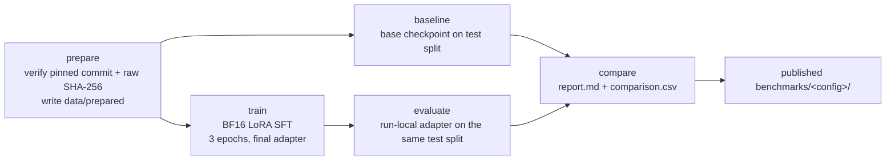

# HoASA ABSA SLM Benchmark

Fine-tuning four small language models to turn Indonesian hotel reviews from the IndoNLU **HoASA** (Airy) dataset into structured sentiment labels for 10 aspects, then scoring every LoRA adapter against its own base checkpoint under one shared prompt, parser and metric.

[Results](#results) · [Quickstart](#quickstart) · [How it works](#how-it-works) · [Methodology](#methodology) · [Reproduction](#reproduction)


## TL;DR

- Four small models, one BF16 LoRA recipe (r=16, alpha=32, 3 epochs), one prompt, one parser, one metric.
- All four improved mean aspect macro-F1 over their base checkpoint.
- Best fine-tuned score: Qwen3.5-0.8B at 0.692 (base 0.253), 79.4% whole-review exact, 100% schema-valid.
- Single-run, task-specific results on a frozen 286-row labeled test split. These are not leaderboard scores.

## Base to LoRA mean aspect macro-F1


Open markers are base checkpoints, filled markers are LoRA adapters, and the dashed line is the shared majority baseline (0.222). Chart values are rounded from the [results table](#results); exact decimals live in the committed `*_metrics.json` files.

Caveat: every number here is one run on one frozen 286-row labeled test split, specific to this task, prompt, parser and metric.

## Task

One review in, one plain JSON object with sentiment for 10 aspects out. Abbreviated example:

```
Review: kamarnya bersih tapi wifi lambat

{"kebersihan": "pos", "wifi": "neg", "service": "neut", "...": "..."}
```

Actual model output contains all 10 aspect keys. Labels are `neg`, `neut`, `pos`, and `neg_pos` (mixed positive and negative sentiment on the same aspect). A review can be positive on one aspect and negative on another; `neut` means no clear sentiment for that aspect.

## Quickstart

```bash
git clone https://github.com/RayhanHaqi/hoasa-slm-benchmark.git
cd hoasa-slm-benchmark
python -m pip install -e . --no-deps
hoasa prepare
hoasa preflight configs/01-qwen3-1.7b.yaml
```

`hoasa prepare` downloads the pinned HoASA CSVs and verifies commit, SHA-256, header, row counts and label values before writing splits to `data/prepared`. `hoasa preflight` is metadata-only (config and tokenizer, no weights).

<details>
<summary>Run a full model benchmark</summary>

```bash
hoasa majority-baseline --run-dir runs/majority
hoasa baseline configs/01-qwen3-1.7b.yaml --run-dir runs/01-qwen3-1.7b
hoasa train configs/01-qwen3-1.7b.yaml --run-dir runs/01-qwen3-1.7b
hoasa evaluate configs/01-qwen3-1.7b.yaml --checkpoint runs/01-qwen3-1.7b/adapter --run-dir runs/01-qwen3-1.7b
hoasa compare --run-dir runs/01-qwen3-1.7b
```

Requires a CUDA GPU and the pinned environment in [Methodology](#methodology). Each configuration runs explicitly; there is no automatic four-model runner.

</details>

## Why this exists

Putting a small model behind an Indonesian review pipeline raises two separate questions: does it understand aspect-level sentiment, and can it emit valid structured JSON every single time? Base checkpoints often fail the second even when they partially handle the first. This benchmark measures both on a fixed task and split, with matched before/after comparisons and invalid outputs kept in the metric denominator.

## Results

Mean aspect macro-F1 is the primary metric. Gain is LoRA minus base. Exact review and schema-valid are computed on the same 286 test rows.

| Model | Base F1 | LoRA F1 | Gain | Exact review | Schema valid |
|---|---|---|---|---|---|
| [Qwen3.5-0.8B](benchmarks/02-qwen3.5-0.8b/) | 0.253 | 0.692 | +0.439 | 79.4% | 100% |
| [Qwen3-1.7B](benchmarks/01-qwen3-1.7b/) | 0.342 | 0.689 | +0.347 | 78.0% | 100% |
| [Qwen3.5-2B](benchmarks/04-qwen3.5-2b/) | 0.475 | 0.676 | +0.201 | 73.4% | 96.5% |
| [LFM2.5-1.2B-Instruct](benchmarks/03-lfm2.5-1.2b-instruct/) | 0.057 | 0.665 | +0.608 | 73.1% | 100% |

Shared majority baseline macro-F1: 0.222 (exact 0.221669), identical in all four runs. Table values are rounded to 3 decimals; each link holds the exact numbers in `report.md` and `*_metrics.json`.

<details>
<summary>Runtime and resource use per model</summary>

Fine-tuned evaluation, one RTX 5060 Ti. Peak VRAM is peak allocated during `model.generate`.

| Model | Peak VRAM (GiB) | Mean latency (ms/review) |
|---|---|---|
| Qwen3-1.7B | 3.397 | 1739.9 |
| Qwen3.5-0.8B | 1.701 | 6037.0 |
| Qwen3.5-2B | 4.259 | 6408.7 |
| LFM2.5-1.2B-Instruct | 2.311 | 692.0 |

Mean latency is `model.generate` time per review, so it includes prefill and is not pure decode throughput. Base-model resource numbers and per-run token counts are in the committed metrics. No efficiency ranking is claimed.

</details>

## How it works



Each review maps to exactly one 10-field JSON object. The base checkpoint and its LoRA adapter see the same prompt, parser and test split, and the majority baseline is scored through the same code path. Invalid outputs stay in the metric denominator as wrong. Every phase re-verifies config, prompt hash, dataset hashes and model revision, and refuses to continue on a mismatch.

## Methodology

### Dataset

IndoNLP/indonlu at pinned commit `ce728f6926a36174b9923dfe49d6a6839b6e9bb7`, `hoasa_absa-airy`, splits used unmodified: train 2283, val 285, test 286 rows. CSV header: `review,ac,air_panas,bau,general,kebersihan,linen,service,sunrise_meal,tv,wifi`. All four runs share the same prepared-test SHA-256 (`10ea1e8c…`), recorded in each `dataset_stats.json`.

`hoasa prepare` verifies the pinned commit URL, SHA-256, header, row counts, every label value and empty cells, then reports duplicates without cleaning, deduplicating, re-splitting, balancing or augmenting.

Caveat: the root IndoNLU README states the HoASA test split is usually distributed masked. In this pinned commit an unmasked, labeled `test_preprocess.csv` exists and is used for evaluation. That is a property of this commit, not an official leaderboard score.

### Task and output

One Indonesian system prompt ([`spec.py`](src/hoasa_benchmark/spec.py)) defines ABSA, all 10 aspects and the four labels, and asks for exactly one plain JSON object with all 10 keys, no code fences and no prose. The user message contains only the review text, never gold labels.

The parser ([`parsing.py`](src/hoasa_benchmark/parsing.py)) runs `json.loads` with duplicate-key detection. Malformed JSON, a non-object or duplicate keys make all aspects `INVALID`; for a parseable object, a missing key or out-of-set value makes only that aspect `INVALID`. `INVALID` is never a fifth macro class but stays in the denominator and counts as a false negative for the gold class.

Primary metric: `mean_aspect_macro_f1 = mean(macro_f1(aspect) for the 10 aspects)`, where each aspect macro-F1 averages F1 over `[neg, neut, pos, neg_pos]` with `zero_division=0`. Secondary metrics: overall aspect accuracy, whole-review exact accuracy (schema-valid and all 10 aspects correct), and syntax/schema/output-valid rates.

### Fine-tuning

Full BF16 base weights, no quantization at any phase. LoRA r=16, alpha=32, dropout 0, bias none; 3 epochs, lr 2e-4, cosine schedule, warmup 0.05, weight decay 0.01, seed 42, effective batch 8. The published adapters are final-epoch adapters; there is no best-checkpoint selection and no resume path.

The review alone is truncated to `max_user_tokens=1536`, the model's native chat template is rendered, and `max_new_tokens=256` is reserved inside `max_seq_length=2048`. The assistant target is never right-truncated.

Configs and requested revisions:

| Config | Base model | Revision |
|---|---|---|
| `01-qwen3-1.7b` | `Qwen/Qwen3-1.7B` | `70d244cc…` |
| `02-qwen3.5-0.8b` | `Qwen/Qwen3.5-0.8B` | `2fc06364…` |
| `03-lfm2.5-1.2b-instruct` | `LiquidAI/LFM2.5-1.2B-Instruct` | `0f604ada…` |
| `04-qwen3.5-2b` | `Qwen/Qwen3.5-2B` | `15852e8c…` |

### Evaluation

Base, adapter and majority baseline run through the identical prompt, parser and metric path. `hoasa evaluate` only accepts the run-local adapter produced by `hoasa train`, and cross-checks config hash, system prompt hash, dataset hashes, base model and revision against `train_metrics.json` and `run_manifest.json` before loading. `hoasa compare` requires matching provenance and fails closed if CUDA/GPU identity or parity library versions (torch, transformers, peft, bitsandbytes, accelerate) differ, so a cross-machine comparison is refused rather than reported.

Per-run mechanics are visible in each benchmark directory: [`resolved_config.yaml`](benchmarks/01-qwen3-1.7b/resolved_config.yaml), [`run_manifest.json`](benchmarks/01-qwen3-1.7b/run_manifest.json), [`train_metrics.json`](benchmarks/01-qwen3-1.7b/train_metrics.json), [`dataset_stats.json`](benchmarks/01-qwen3-1.7b/dataset_stats.json), [`environment.json`](benchmarks/01-qwen3-1.7b/environment.json) and the parity gate in [`compare.py`](src/hoasa_benchmark/compare.py).

### Hardware

All runs on one NVIDIA GeForce RTX 5060 Ti, CUDA 12.8, `torch 2.11.0+cu128`. Validated environment: Python 3.11.16, `transformers 5.5.0`, `peft 0.20.0`, `trl 0.24.0`, `unsloth 2026.9.4`, `datasets 4.3.0`, `bitsandbytes 0.50.2`. `scikit-learn` is intentionally not used; all metrics are implemented in this repository. Each run records its full `environment.json`.

### Limitations

- Single run per configuration. No confidence intervals, no significance tests; cross-model differences are descriptive only.
- 286 test rows, one dataset, one language, one prompt, parser and metric implementation. Results will not transfer unchanged to other tasks.
- The labeled test split is a property of the pinned commit, not an official IndoNLU score.
- Whole-review exact accuracy and schema-valid rate are strict: all 10 aspects correct, all 10 keys valid.

## Reproduction

```bash
python -m pip install -e . --no-deps              # only PyYAML is required
python -m unittest discover -s tests -v           # 94 tests, no GPU, no network
hoasa prepare                                     # download/verify pinned CSVs, write data/prepared
hoasa preflight CONFIG                            # metadata-only tokenizer/length report
hoasa majority-baseline --run-dir runs/majority   # train-majority floor
hoasa baseline CONFIG --run-dir DIR               # base model on the frozen test split
hoasa train CONFIG --run-dir DIR                  # BF16 LoRA SFT
hoasa evaluate CONFIG --checkpoint DIR/adapter --run-dir DIR
hoasa compare --run-dir DIR                       # report.md + comparison.csv
```

A fresh clone reproduces the pipeline, not the published artifacts. `data/`, `runs/`, adapters, checkpoints and weights are git-ignored; the ML phases need the pinned environment above and a CUDA GPU. Each configuration is run explicitly.

## Evidence

| Model | Report | Metrics | Predictions |
|---|---|---|---|
| Qwen3-1.7B | [report](benchmarks/01-qwen3-1.7b/report.md) | [base](benchmarks/01-qwen3-1.7b/baseline_metrics.json) · [LoRA](benchmarks/01-qwen3-1.7b/finetuned_metrics.json) | [base](benchmarks/01-qwen3-1.7b/baseline_predictions.jsonl) · [LoRA](benchmarks/01-qwen3-1.7b/finetuned_predictions.jsonl) |
| Qwen3.5-0.8B | [report](benchmarks/02-qwen3.5-0.8b/report.md) | [base](benchmarks/02-qwen3.5-0.8b/baseline_metrics.json) · [LoRA](benchmarks/02-qwen3.5-0.8b/finetuned_metrics.json) | [base](benchmarks/02-qwen3.5-0.8b/baseline_predictions.jsonl) · [LoRA](benchmarks/02-qwen3.5-0.8b/finetuned_predictions.jsonl) |
| LFM2.5-1.2B-Instruct | [report](benchmarks/03-lfm2.5-1.2b-instruct/report.md) | [base](benchmarks/03-lfm2.5-1.2b-instruct/baseline_metrics.json) · [LoRA](benchmarks/03-lfm2.5-1.2b-instruct/finetuned_metrics.json) | [base](benchmarks/03-lfm2.5-1.2b-instruct/baseline_predictions.jsonl) · [LoRA](benchmarks/03-lfm2.5-1.2b-instruct/finetuned_predictions.jsonl) |
| Qwen3.5-2B | [report](benchmarks/04-qwen3.5-2b/report.md) | [base](benchmarks/04-qwen3.5-2b/baseline_metrics.json) · [LoRA](benchmarks/04-qwen3.5-2b/finetuned_metrics.json) | [base](benchmarks/04-qwen3.5-2b/baseline_predictions.jsonl) · [LoRA](benchmarks/04-qwen3.5-2b/finetuned_predictions.jsonl) |

Each benchmark directory also contains its resolved config, environment, dataset stats, run manifest, training metrics, comparison CSV and majority baseline artifacts.

## Repository structure

```
src/hoasa_benchmark/   CLI, prepare/verify, prompt and parser, training, evaluation, parity gates
configs/               four pinned BF16 LoRA configs
benchmarks/            published metrics, reports, predictions, manifests
assets/                macro-F1 dumbbell chart
tests/                 94 unit tests, no GPU, no network
pyproject.toml         editable install and the hoasa entry point
```

## Related benchmark

[GitHub Issue Triage](https://github.com/RayhanHaqi/github-triage-slm-benchmark) applies the same small-model approach to binary issue classification.
